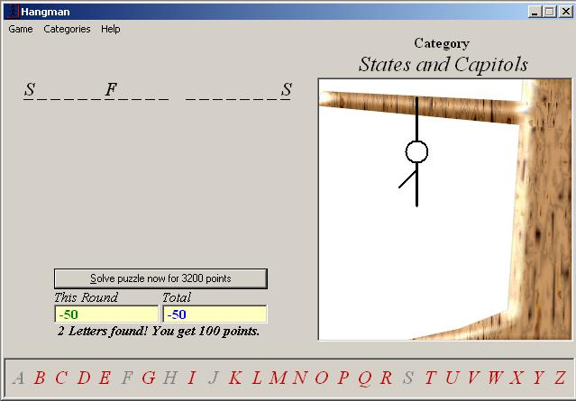



## Hangman

### Description

Try to solve the puzzle without hanging the

stick figure man. Every wrong guess adds

another body part.

 THis is my 2nd submission to PSC within 3 days.

I got good good response for my first submission i.e. Accounts Management System which i developed just in 15 hours.

So I decided to make more contribution to PSC.

then I decided to develop a game and atlast I developed HANGAMN within 3 days.

This is a very useful game which will help u ppl understand the use of files nd getting data and much more.....

All the categories are stored as .hm files which are actually .txt files.

 Thanks for downloading! I hope you find this program useful.

Please vote for me, post your feedbacks, comments, questions, queries, errors if found etc.

If you have any query abt Hangman let me know.....

And plz do RATE it.

    And I think HANGMAN should win this month....cuz its can be understood ny any type of programmer.
 
### More Info
 

             |
---                |---
**Submitted On**   |2005-01-22 22:09:38
**By**             |[Zulqarnain](https://github.com/Planet-Source-Code/PSCIndex/blob/master/ByAuthor/zulqarnain.md)
**Level**          |Intermediate
**User Rating**    |4.6 (23 globes from 5 users)
**Compatibility**  |VB 3\.0, VB 4\.0 \(16\-bit\), VB 4\.0 \(32\-bit\), VB 5\.0, VB 6\.0
**Category**       |[Games](https://github.com/Planet-Source-Code/PSCIndex/blob/master/ByCategory/games__1-38.md)
**World**          |[Visual Basic](https://github.com/Planet-Source-Code/PSCIndex/blob/master/ByWorld/visual-basic.md)
**Archive File**   |[Hangman2019589132006\.zip](https://github.com/Planet-Source-Code/zulqarnain-hangman__1-66544/archive/master.zip)

